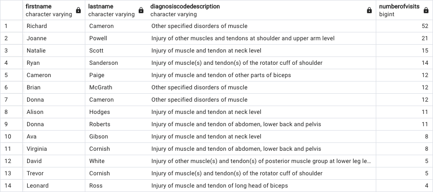

## The following queries and questions related to musculoskeletal (MSK) healthcare data were executed for additional practice and a step to a larger personalized project. 

###  What are the muscle -related diagnosis descriptions? Who were the patients that presented with muscle related issues? How many visits occurred related to this issue? 
#### Query
SELECT firstname,lastname,diagnosiscodedescription, 
 COUNT(facttable.dimdateservicepk) AS numberofvisits
 FROM facttable
 INNER JOIN dimdiagnosiscode
 ON dimdiagnosiscode.dimdiagnosiscodepk = facttable.dimdiagnosiscodepk
 INNER JOIN dimpatient
 ON dimpatient.dimpatientpk = facttable.dimpatientpk
 WHERE diagnosiscodedescription ILIKE '%muscle%'
 OR diagnosiscodedescription ILIKE '%fracture%'
 OR diagnosiscodedescription ILIKE '%strain%'
 OR diagnosiscodedescription ILIKE '%sprain%'
 GROUP BY firstname,lastname,diagnosiscodedescription
 ORDER BY numberofvisits DESC;
#### Output

