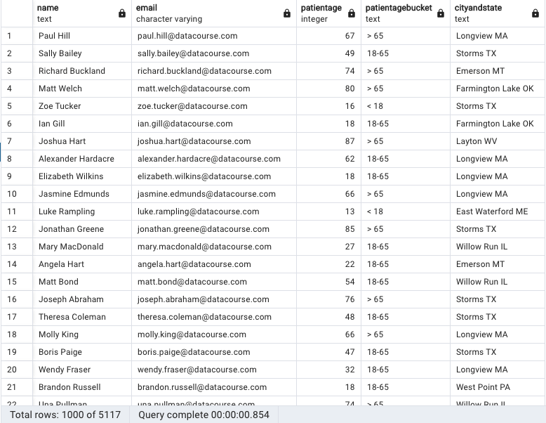
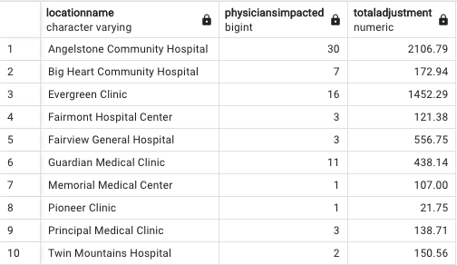
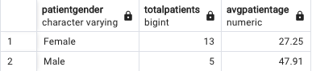
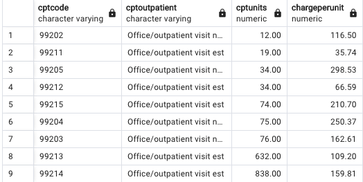
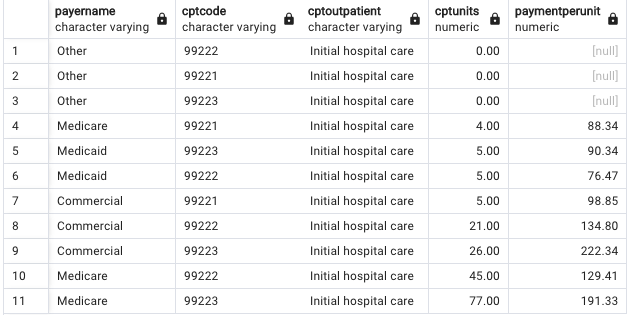

# Healthcare Data SQL Practice Questions 

### 1. How many rows of data are in the FactTable that include a Gross Charge greater than $100? 
#### Query
SELECT count(grosscharge) AS CountOfRows 
 FROM facttable
 WHERE grosscharge > 100.00;
#### Output
-- 5513

### 2. How many unique patients exist in the Healthcare_DB?
#### Query
SELECT COUNT(DISTINCT(patientnumber)) AS NumberOfUniquePatients 
 FROM dimpatient;
#### Output
-- 4962

### 3. How many CptCodes are in each CptGrouping?
#### Query
SELECT cptgrouping, COUNT(DISTINCT(cptcode)) AS CountOfCptCodes
  FROM dimcptcode
  GROUP BY cptgrouping
  ORDER BY 2 DESC;

#### Output

### 4. How many providers have submitted a Medicare insurance claims?
#### Query
SELECT COUNT(DISTINCT(providernpi)) AS countofproviders
 FROM facttable 
 INNER JOIN dimphysician
 ON dimphysician.dimphysicianpk = facttable.dimphysicianpk
 INNER JOIN dimpayer
 ON dimpayer.dimpayerpk = facttable.dimpayerpk
 WHERE payername = 'Medicare';

#### Output
-- 682

### 5. Calculate the gross collection rate for each location name - see below; GCR = payments divided gross charge. Which locationname has the highest GCR? 
#### Query
SELECT locationname, 100 *(-SUM(payment)/ sum(grosscharge)) AS GCR_Percent
  FROM facttable
  INNER JOIN dimlocation
  ON dimlocation.dimlocationpk = facttable.dimlocationpk
  GROUP BY  locationname
  ORDER BY 2 DESC;
#### Output

### 6. How many CptCodes have more than 100 units?
#### Query
SELECT COUNT(*) AS cptwithgreaterthanhundredunits
  FROM(
 	SELECT cptcode, SUM(cptunits)
 	FROM facttable 
 	INNER JOIN dimcptcode
 	ON dimcptcode.dimcptcodepk = facttable.dimcptcodepk
 	GROUP BY cptcode
 	HAVING SUM(cptunits) > 100) AS a; 
#### Output
-- 29

### 7. Find the physician specialty that has received the highest amount of payments. Then show the payments by month for this group of physicians. 
#### Query
SELECT providerspecialty, monthperiod, monthyear,  -SUM(payment) AS payments
 FROM facttable
 INNER JOIN dimdate
 ON dimdate.dimdatepostpk = facttable.dimdatepostpk
 INNER JOIN dimphysician
 ON dimphysician.dimphysicianpk = facttable.dimphysicianpk
 WHERE providerspecialty = 'Internal Medicine'
 GROUP BY providerspecialty, monthperiod, monthyear
 ORDER BY monthperiod;
#### Output

### 8. How many Cpt Units by DiagnosisCodeGroup are assigned to a "J code" diagnosis? 
#### Query
SELECT diagnosiscodegroup, SUM(cptunits) as totalunits
 FROM facttable
 INNER JOIN dimdiagnosiscode
 ON dimdiagnosiscode.dimdiagnosiscodepk = facttable.dimdiagnosiscodepk
 WHERE diagnosiscode ILIKE '%j%'
 GROUP BY diagnosiscodegroup
 ORDER BY totalunits;
#### Output

### 9. You've been asked to put together a report that details patient demographics. The report should group patients into three buckets - under 18, between 18-65, and over 65. 
#### Query
SELECT firstname || ' ' || lastname AS Name, email, patientage,
  CASE 
  WHEN (patientage < 18) THEN '< 18'
  WHEN (patientage BETWEEN 18 AND 65) THEN '18-65'
  WHEN (patientage > 65) THEN '> 65'
  ELSE null 
  END AS Patientagebucket,
  city || ' ' || state AS Cityandstate
  FROM dimpatient;
#### Output

### 10. How many dollars have been written off (adjustments) due to credentialing (adjustment reason)? Which location has the highest number of credentialing adjustments? How many physicians at this location have been impacted by credentialing adjustments? What does this mean?
#### Query
SELECT locationname, COUNT(DISTINCT(providernpi)) AS physiciansimpacted, - SUM(adjustment) AS totaladjustment 
  FROM facttable
  INNER JOIN dimtransaction
 ON dimtransaction.dimtransactionpk = facttable.dimtransactionpk
  INNER JOIN dimlocation
  ON dimlocation.dimlocationpk = facttable.dimlocationpk
  INNER JOIN dimphysician
 ON dimphysician.dimphysicianpk = facttable.dimphysicianpk
 WHERE transactiontype = 'Adjustment' AND  adjustmentreason = 'Credentialing'
 GROUP BY locationname;
#### Output

-- What does this mean? Based on the data there are a total of 30 physicians at 'Anglestone Community Hospital' who are not credentialed and allowing a total of $2106.79 to be written off. 

### 11. What is the average patientage by gender for patients seen at Big Heart Community Hospital with a Diagnosis that included Type 2 Diabetes? And how many patients are included in that average? 

#### Query
SELECT patientgender, COUNT(DISTINCT(dimpatient.patientnumber)) AS totalpatients, 
  ROUND(AVG(patientage),2) AS avgpatientage
  FROM facttable
 INNER JOIN dimlocation
 ON dimlocation.dimlocationpk = facttable.dimlocationpk
 INNER JOIN dimpatient
 ON dimpatient.dimpatientpk = facttable.dimpatientpk
 INNER JOIN dimdiagnosiscode
 ON dimdiagnosiscode.dimdiagnosiscodepk = facttable.dimdiagnosiscodepk
 WHERE diagnosiscodedescription ILIKE '%type 2%' AND
 locationname ILIKE '%Big Heart Community Hospital%'
 GROUP BY patientgender;
#### Output

### 12. There are a two visit types that you have been asked to compare (use CptDesc).  Office outpateint visit  est vs new. Show each Cpt Code, Cpt desc, and the associated Cpt units. What is the charge per Cpt Units? What does this mean?
#### Query
SELECT cptcode, cptdesc AS cptoutpatient, 
 SUM(cptunits) AS cptunits, ROUND(SUM(grosscharge)/SUM(cptunits),2) AS chargeperunit
 FROM facttable
 INNER JOIN dimcptcode
 ON dimcptcode.dimcptcodepk = facttable.dimcptcodepk
 WHERE cptdesc ILIKE '%outpatient%est%' OR cptdesc ILIKE '%outpatient%new%'
 GROUP BY cptcode, cptdesc
 ORDER BY cptunits;
#### Output

### 13.Analyze paymentperunit by payername. Complete this analysis by the following visit type (CptDesc) Initial Hospital Care. 

#### Query
SELECT payername, cptcode, cptdesc AS cptoutpatient, 
 SUM(cptunits) AS cptunits, ROUND(-SUM(payment)/NULLIF(SUM(cptunits),0),2) AS paymentperunit
 FROM facttable
 INNER JOIN dimcptcode
 ON dimcptcode.dimcptcodepk = facttable.dimcptcodepk
 INNER JOIN dimpayer
 ON dimpayer.dimpayerpk = facttable.dimpayerpk
 WHERE cptdesc ILIKE '%initial%hospital%care%'
 GROUP BY payername, cptcode, cptdesc
 ORDER BY cptunits;
#### Output

### Find the NetCharge (Gross Charges - Contractual Adjustments). Calculate the Net Collection Rate (Payments/Netcharge) for each speciality. Which a has the worst NCR w/ a NC greater than $25,000?

#### Query
SELECT providerspecialty, 
 grosscharges, 
 ontractualadjustment, 
 	netcharge, 
 	payments, 
 	adjustments - contractualadjustment AS adjustments,
 	ROUND(100*(-payments/netcharge)) AS netcollectionrate, 
 	AR,
 	ROUND(100*(AR/netcharge)) AS percentinAR,
 	ROUND(-100*(adjustments - contractualadjustment)/netcharge) AS writeoffpercent
 FROM
 	(SELECT providerspecialty,
 	SUM (grosscharge) AS grosscharges, 
 	SUM(CASE 
 	WHEN adjustmentreason = 'Contractual' THEN adjustment
 	ELSE Null
 	END) AS contractualadjustment,
 	(SUM(grosscharge) + SUM(CASE 
 	WHEN adjustmentreason = 'Contractual' THEN adjustment
 	ELSE Null
 	END)) AS netcharge,
 	SUM (payment) AS payments,
 	SUM (adjustment) AS adjustments, 
 	SUM (ar) AS AR
 	FROM facttable
 	INNER JOIN dimphysician
 	ON dimphysician.dimphysicianpk = facttable.dimphysicianpk
 	INNER JOIN dimtransaction
 	ON dimtransaction.dimtransactionpk = facttable.dimtransactionpk
 	GROUP BY providerspecialty) A
 WHERE
 	netcharge > 25000
 ORDER BY netcollectionrate;

#### Output

